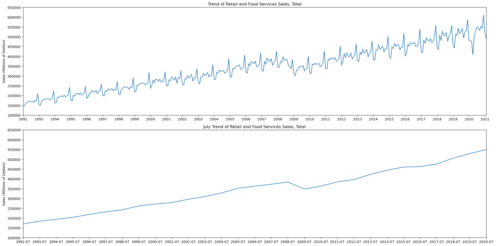
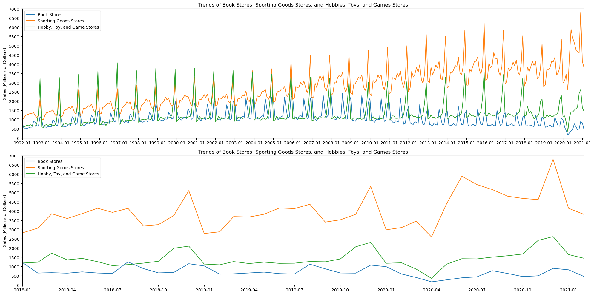
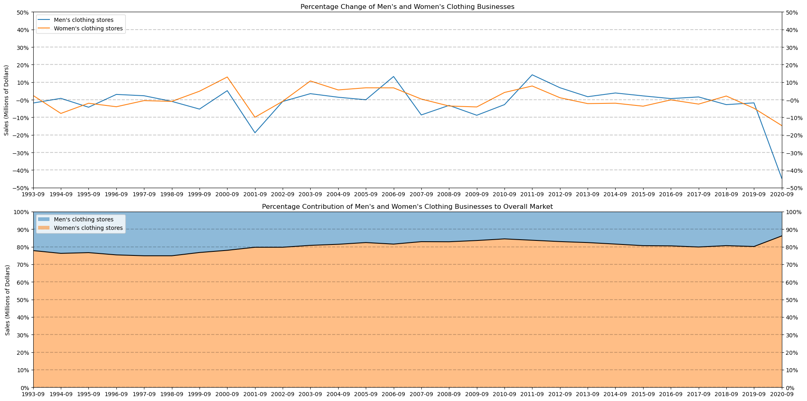
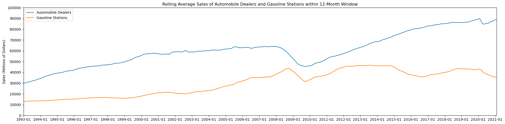

# ETL Processing and Time Series Analysis of MRTS Dataset

**Sicong E**

# Index

- [Abstract](#Abstract)
- [1. Introduction](#1.-Introduction)
- [2. Extract-Transform-Load](#2.-Extract-Transform-Load)
    - [2.1 The ETL Process](#2.1-The-ETL-Process)
    - [2.2 Data Exploration](#2.2-Data-Exploration)
    - [2.3 Data Preparation](#2.3-Data-Preparation)
    - [2.4 Read MRTS Data](#2.4-Read-MRTS-Data)
    - [2.5 Database Creation](#2.5-Database-Creation)
- [3. Analysis and Visualization](#3.-Analysis-and-Visualization)
    - [3.1 Run Queries From Python](#3.1-Run-Queries-From-Python)
    - [3.2 Explore Trends](#3.2-Explore-Trends)
    - [3.3 Explore Percentage Change](#3.3-Explore-Percentage-Change)
    - [3.4 Explore Rolling Time Windows](#3.4-Explore-Rolling-Time-Windows)
- [Conclusion](#Conclusion)
- [References](#References)

[Back to top](#Index)


##  Abstract

The Monthly Retail Trade Survey (MRTS) is conducted by the U.S. Census Bureau to gather data from retail businesses, providing insights into the retail sector's performance. This data covers various aspects of retail, including sales and inventories. This project has two primary goals: to perform ETL (Extract, Transform, Load) processing on the MRTS dataset using Python and powerful data transformation libraries like Pandas and SQLAlchemy, and to apply key time series analysis techniques to analyze the data of target businesses. The process involves using MySQL for data retrieval and Python for detailed data manipulation and visualization.

[Back to top](#Index)


## 1. Introduction

This project consists of three main steps:
1. **Data Extraction and Normalization**: The process starts with extracting data from the MRTS dataset Excel file using `pandas.ExcelFile`. Specific rows and columns are retained for each worksheet. Each worksheet is converted into a Pandas DataFrame, normalized, and saved as a CSV file.
2. **Database Creation and Data Loading**: Next, a connection to the MySQL database is established by creating an engine with `sqlalchemy.create_engine` and a connection string using the MySQL Connector driver. SQL queries are executed from Python to create the database structure, and the extracted CSV files are loaded into the database.
3. **Time Series Analysis and Visualization**: Finally, key techniques such as trend analysis, percentage changes, and rolling time windows are applied to analyze the time series data in the database. The manipulated data of target businesses is visualized using the Matplotlib library, with plots refined to interpret the data and derive meaningful insights.

[Back to top](#Index)

## 2. Extract-Transform-Load

[Back to top](#Index)

### 2.1 The ETL Process

The integrated ETL process for the MRTS dataset involves:

1. **Extract**: Data is extracted from an Excel file containing multiple worksheets, but only the *Not-Adjusted* data and the columns for *Kind of Business* and all 12 months are retained. Any extraneous data, including aggregation rows or columns, is excluded. This extraction process is facilitated by preliminary data cleaning and manipulation using `pandas.ExcelFile`.
2. **Transform**: Preliminary data cleaning and manipulation are performed within the DataFrames, which are then exported to CSV files. The transformation process is automated using a CSV extraction script that outputs CSV files through the `pandas.to_csv` function.
3. **Load**: The CSV files are loaded into a MySQL database as tables. A database creation script utilizes `sqlalchemy.create_engine` and `mysql.connector` for database connectivity. This script creates the *mrts* database in MySQL (if it does not already exist) and loads the CSV files into the database as tables.

[Back to top](#Index)

### 2.2 Data Exploration

The data for the Monthly Retail Trade Survey (MRTS) released by the *[U.S. Census Bureau](https://www.census.gov/retail/index.html)* is gathered from retail businesses to provide information about the retail sector's performance in the United States.

The raw Excel data is organized with one worksheet per year, from 1992 to 2021. Each worksheet lists the estimated monthly economic activity in the retail sector on a per-month basis. The spending data is broken down by industry (sector) and identified by one or several numeric codes. The data is presented in millions of dollars. Note that only the sales data for the first two months of 2021 are provided, and it is necessary to distinguish its table structure from other years.

If the data does not meet publication standards due to high sampling variability or other quality concerns, it is shown as *(S)* and considered "suppressed." These values should be converted to null. However, they can be left as is without conversion during the transform process if needed. When analysis involves any *(S)* values, they will be reviewed and handled on a case-by-case basis. For instance, under Section 3.3, missing data for men's clothing stores in 2020 were treated by imputation using a linear method.

There are two main categories of estimates: *Non-adjusted* and *Adjusted*. *Non-adjusted* is the raw sales data, while *Adjusted* are the estimates presents sales data adjusted for seasonal variations, holidays, or other factors to provide a more accurate picture of monthly sales trends. For the purposes of this project's analysis, the *Non-adjusted* data was used.

[Back to top](#Index)

### 2.3 Data Preparation


```python
import os
import pandas as pd
import numpy as np

# Create a new directory for storing exported csv files
path = os.getcwd()+'/csv'
isExist = os.path.exists(path)
if not isExist:
    os.makedirs(path)

# Get all sheet names from the original Excel for csv exporting
xls = pd.ExcelFile('mrtssales92-present.xls')
sheets = xls.sheet_names[1:]

# Import the Excel into DataFrames by sheet name, which involves adding headers, slicing rows and columns for use,
# and including a "Total" column for the adjusted values, which were not originally present 
months = ['Jan','Feb','Mar','Apr','May','Jun','Jul','Aug','Sep','Oct','Nov','Dec']
for sheet in sheets:
    col_labels = ['Kind of Business']
    for month in months:
        col_labels.append(month+' '+sheet)
    col_labels.append('Total')
    # Specify the columns and rows for use through the specific arguments of the read_excel function
    df_sheet = pd.read_excel('mrtssales92-present.xls', sheet_name=sheet, header=None, names=col_labels,
                          index_col=0, usecols=list(range(1,15)), skiprows=6, nrows=65)
    # Export the organized DataFrame of each sheet to a csv and save it in the pre-specified directory
    df_sheet.to_csv(f'{path}/{sheet}.csv')
    print(f'"{sheet}.csv" saved in folder "csv" successfully!')

# Sales data is only available for the first 2 months of 2021, it's necessary to differentiate its table structure
# Customize and export the sheet for 2021 separately through the following code
col_2021 = ['Kind of Business', 'Jan 2021', 'Feb 2021']
df_2021 = pd.read_excel('mrtssales92-present.xls', sheet_name='2021', header=None, names=col_2021,
                          index_col=0, usecols=list(range(1,4)), skiprows=6, nrows=65)
df_2021['Total'] = df_2021.sum(axis=1)
df_2021.to_csv(f'{path}/2021.csv')
print(f'"2021.csv" saved in folder "csv" successfully!')
```

    "2020.csv" saved in folder "csv" successfully!
    "2019.csv" saved in folder "csv" successfully!
    "2018.csv" saved in folder "csv" successfully!
    "2017.csv" saved in folder "csv" successfully!
    "2016.csv" saved in folder "csv" successfully!
    "2015.csv" saved in folder "csv" successfully!
    "2014.csv" saved in folder "csv" successfully!
    "2013.csv" saved in folder "csv" successfully!
    "2012.csv" saved in folder "csv" successfully!
    "2011.csv" saved in folder "csv" successfully!
    "2010.csv" saved in folder "csv" successfully!
    "2009.csv" saved in folder "csv" successfully!
    "2008.csv" saved in folder "csv" successfully!
    "2007.csv" saved in folder "csv" successfully!
    "2006.csv" saved in folder "csv" successfully!
    "2005.csv" saved in folder "csv" successfully!
    "2004.csv" saved in folder "csv" successfully!
    "2003.csv" saved in folder "csv" successfully!
    "2002.csv" saved in folder "csv" successfully!
    "2001.csv" saved in folder "csv" successfully!
    "2000.csv" saved in folder "csv" successfully!
    "1999.csv" saved in folder "csv" successfully!
    "1998.csv" saved in folder "csv" successfully!
    "1997.csv" saved in folder "csv" successfully!
    "1996.csv" saved in folder "csv" successfully!
    "1995.csv" saved in folder "csv" successfully!
    "1994.csv" saved in folder "csv" successfully!
    "1993.csv" saved in folder "csv" successfully!
    "1992.csv" saved in folder "csv" successfully!
    "2021.csv" saved in folder "csv" successfully!


[Back to top](#Index)

### 2.4 Read MRTS Data

Python offers many methods for reading and handling CSV and Excel files, with the Pandas library being particularly effective for these tasks. Simple functions such as `pandas.read_csv` (an alternative to `csv.reader`), `pandas.ExcelFile`, and `pandas.ExcelFile.sheet_names` allow the contents of properly formed CSV, Excel, or Excel worksheets to be easily loaded into DataFrames for manipulation. As detailed in Section 2.3, the MRTS CSV files, organized by year, have all been successfully saved in the *csv* directory. The data from each year can be read and stored in a DataFrame. Below is an example of reading a CSV file (2008.csv) containing data for 2008.


```python
path = os.getcwd()+'/csv/2008.csv'

df = pd.read_csv(path)
df
```


<div>
<style scoped>
    .dataframe tbody tr th:only-of-type {
        vertical-align: middle;
    }

    .dataframe tbody tr th {
        vertical-align: top;
    }

    .dataframe thead th {
        text-align: right;
    }
</style>
<table border="1" class="dataframe">
  <thead>
    <tr style="text-align: right;">
      <th></th>
      <th>Kind of Business</th>
      <th>Jan 2008</th>
      <th>Feb 2008</th>
      <th>Mar 2008</th>
      <th>Apr 2008</th>
      <th>May 2008</th>
      <th>Jun 2008</th>
      <th>Jul 2008</th>
      <th>Aug 2008</th>
      <th>Sep 2008</th>
      <th>Oct 2008</th>
      <th>Nov 2008</th>
      <th>Dec 2008</th>
      <th>Total</th>
    </tr>
  </thead>
  <tbody>
    <tr>
      <th>0</th>
      <td>Retail and food services sales, total</td>
      <td>342639</td>
      <td>343893</td>
      <td>372907</td>
      <td>368920</td>
      <td>397956</td>
      <td>378507</td>
      <td>383726</td>
      <td>382862</td>
      <td>350542</td>
      <td>349847</td>
      <td>335545</td>
      <td>384236</td>
      <td>4391580</td>
    </tr>
    <tr>
      <th>1</th>
      <td>Retail sales and food services excl motor vehi...</td>
      <td>276796</td>
      <td>274863</td>
      <td>296293</td>
      <td>295184</td>
      <td>321829</td>
      <td>309079</td>
      <td>314049</td>
      <td>313186</td>
      <td>290053</td>
      <td>294821</td>
      <td>287679</td>
      <td>331883</td>
      <td>3605715</td>
    </tr>
    <tr>
      <th>2</th>
      <td>Retail sales and food services excl gasoline s...</td>
      <td>303949</td>
      <td>306277</td>
      <td>330681</td>
      <td>325257</td>
      <td>349444</td>
      <td>328422</td>
      <td>331998</td>
      <td>333794</td>
      <td>305360</td>
      <td>309222</td>
      <td>305676</td>
      <td>357861</td>
      <td>3887941</td>
    </tr>
    <tr>
      <th>3</th>
      <td>Retail sales and food services excl motor vehi...</td>
      <td>238106</td>
      <td>237247</td>
      <td>254067</td>
      <td>251521</td>
      <td>273317</td>
      <td>258994</td>
      <td>262321</td>
      <td>264118</td>
      <td>244871</td>
      <td>254196</td>
      <td>257810</td>
      <td>305508</td>
      <td>3102076</td>
    </tr>
    <tr>
      <th>4</th>
      <td>Retail sales, total</td>
      <td>307576</td>
      <td>308171</td>
      <td>334416</td>
      <td>331002</td>
      <td>357277</td>
      <td>339791</td>
      <td>344158</td>
      <td>342443</td>
      <td>313308</td>
      <td>311422</td>
      <td>299238</td>
      <td>346513</td>
      <td>3935315</td>
    </tr>
    <tr>
      <th>...</th>
      <td>...</td>
      <td>...</td>
      <td>...</td>
      <td>...</td>
      <td>...</td>
      <td>...</td>
      <td>...</td>
      <td>...</td>
      <td>...</td>
      <td>...</td>
      <td>...</td>
      <td>...</td>
      <td>...</td>
      <td>...</td>
    </tr>
    <tr>
      <th>60</th>
      <td>Food services and drinking places</td>
      <td>35063</td>
      <td>35722</td>
      <td>38491</td>
      <td>37918</td>
      <td>40679</td>
      <td>38716</td>
      <td>39568</td>
      <td>40419</td>
      <td>37234</td>
      <td>38425</td>
      <td>36307</td>
      <td>37723</td>
      <td>456265</td>
    </tr>
    <tr>
      <th>61</th>
      <td>Drinking places</td>
      <td>1497</td>
      <td>1528</td>
      <td>1709</td>
      <td>1655</td>
      <td>1742</td>
      <td>1696</td>
      <td>1883</td>
      <td>1839</td>
      <td>1675</td>
      <td>1711</td>
      <td>1619</td>
      <td>1676</td>
      <td>20230</td>
    </tr>
    <tr>
      <th>62</th>
      <td>Restaurants and other eating places</td>
      <td>30334</td>
      <td>30854</td>
      <td>33274</td>
      <td>32299</td>
      <td>34833</td>
      <td>33284</td>
      <td>34081</td>
      <td>34746</td>
      <td>31019</td>
      <td>32543</td>
      <td>31117</td>
      <td>32664</td>
      <td>391048</td>
    </tr>
    <tr>
      <th>63</th>
      <td>Full service restaurants</td>
      <td>15506</td>
      <td>15862</td>
      <td>17102</td>
      <td>16289</td>
      <td>17706</td>
      <td>16704</td>
      <td>16957</td>
      <td>17422</td>
      <td>15356</td>
      <td>15973</td>
      <td>15532</td>
      <td>16644</td>
      <td>197053</td>
    </tr>
    <tr>
      <th>64</th>
      <td>Limited service eating places</td>
      <td>14828</td>
      <td>14992</td>
      <td>16172</td>
      <td>16010</td>
      <td>17127</td>
      <td>16580</td>
      <td>17124</td>
      <td>17324</td>
      <td>15663</td>
      <td>16570</td>
      <td>15585</td>
      <td>16020</td>
      <td>193995</td>
    </tr>
  </tbody>
</table>
<p>65 rows × 14 columns</p>
</div>


[Back to top](#Index)

### 2.5 Database Creation


```python
import mysql.connector
import yaml
import os
from sqlalchemy import create_engine
import pandas as pd

doc = yaml.safe_load(open('mysql_cnx_config.yaml'))
config = {
    'user':doc['user'],
    'passwd':doc['passwd'],
    'host':doc['host'],
    }

# Create an SQLAlchemy engine for MySQL via the assigned driver 'MySQL Connectors'
# url should follow 'mysql+mysqlconnector://<user>:<password>@<host>[:<port>]/<dbname>' format
url = 'mysql+mysqlconnector://{0}:{1}@{2}'.format(
    config['user'],config['passwd'],config['host'])
engine = create_engine(url)

try:
    # Install the driver 'MySQL Connectors'
    cnx = mysql.connector.connect(**config)
    cursor = cnx.cursor()

    # Create the database by executing SQL queries directly on the created engine object 
    cursor.execute('CREATE DATABASE IF NOT EXISTS mrts')
    print('Database "mrts" created successfully!')

    # Get the list of csv files from the directory in a defensive way
    fi_ls = [fi for fi in os.listdir(os.getcwd()+'/csv') if fi.endswith('.csv')]

    # Store the looped csv files in DataFrames and write them as tables into the SQL database via the engine
    for fi in fi_ls:
        df = pd.read_csv(os.path.join(os.getcwd(),'csv',fi))
        # Use to_sql(name,con,schema=None,if_exists='fail',index=True) method to load DataFrames into the database
        # The engine must be assigned to argument 'con'. The loading process does not success without SQLAlchemy
        tbl = fi.replace('.csv','')
        df.to_sql(f'{tbl}', con=engine, schema='mrts', if_exists='replace', index=False)
        print(f'Data from "{fi}" loaded into table "{tbl}" successfully!')

except mysql.connector.Error as err:
    print(f'Error: {err}')
```

    Database "mrts" created successfully!
    Data from "1993.csv" loaded into table "1993" successfully!
    Data from "1992.csv" loaded into table "1992" successfully!
    Data from "1996.csv" loaded into table "1996" successfully!
    Data from "1997.csv" loaded into table "1997" successfully!
    Data from "1995.csv" loaded into table "1995" successfully!
    Data from "1994.csv" loaded into table "1994" successfully!
    Data from "2008.csv" loaded into table "2008" successfully!
    Data from "2020.csv" loaded into table "2020" successfully!
    Data from "2021.csv" loaded into table "2021" successfully!
    Data from "2009.csv" loaded into table "2009" successfully!
    Data from "2019.csv" loaded into table "2019" successfully!
    Data from "2018.csv" loaded into table "2018" successfully!
    Data from "2001.csv" loaded into table "2001" successfully!
    Data from "2015.csv" loaded into table "2015" successfully!
    Data from "2014.csv" loaded into table "2014" successfully!
    Data from "2000.csv" loaded into table "2000" successfully!
    Data from "2016.csv" loaded into table "2016" successfully!
    Data from "2002.csv" loaded into table "2002" successfully!
    Data from "2003.csv" loaded into table "2003" successfully!
    Data from "2017.csv" loaded into table "2017" successfully!
    Data from "2013.csv" loaded into table "2013" successfully!
    Data from "2007.csv" loaded into table "2007" successfully!
    Data from "2006.csv" loaded into table "2006" successfully!
    Data from "2012.csv" loaded into table "2012" successfully!
    Data from "2004.csv" loaded into table "2004" successfully!
    Data from "2010.csv" loaded into table "2010" successfully!
    Data from "2011.csv" loaded into table "2011" successfully!
    Data from "2005.csv" loaded into table "2005" successfully!
    Data from "1999.csv" loaded into table "1999" successfully!
    Data from "1998.csv" loaded into table "1998" successfully!


[Back to top](#Index)

## 3. Analysis and Visualization

[Back to top](#Index)

### 3.1 Run Queries From Python


```python
import mysql.connector
import yaml
import pandas as pd

# The connection string provides info about a data server and how the connection to it is made
doc = yaml.safe_load(open('SQL_Conn_Config.yaml'))
config = {
    'user':doc['user'],
    'passwd':doc['passwd'],
    'host':doc['host'],
    'db':doc['db']}

# The cursor class allows Python code to execute SQL commands in a database session
cnx = mysql.connector.connect(**config)

# Assign cursor function to a handle to issue queries
cursor = cnx.cursor()

# Execute SQL query using the execute method of the cursor class in mysql.connector library
cursor.execute('SELECT * FROM mrts.`2008` WHERE Total >= 1500000 ORDER BY `Total` DESC')
for row in cursor.fetchall():
    print(row)

cursor.execute('SELECT COUNT(*) Count FROM mrts.`2008`')
print(cursor.fetchone())
```

    ('Retail and food services sales, total', 342639, 343893, 372907, 368920, 397956, 378507, 383726, 382862, 350542, 349847, 335545, 384236, 4391580)
    ('Retail sales, total', 307576, 308171, 334416, 331002, 357277, 339791, 344158, 342443, 313308, 311422, 299238, 346513, 3935315)
    ('Retail sales and food services excl gasoline stations', 303949, 306277, 330681, 325257, 349444, 328422, 331998, 333794, 305360, 309222, 305676, 357861, 3887941)
    ('Retail sales and food services excl motor vehicle and parts', 276796, 274863, 296293, 295184, 321829, 309079, 314049, 313186, 290053, 294821, 287679, 331883, 3605715)
    ('Retail sales, total (excl. motor vehicle and parts dealers)', 241733, 239141, 257802, 257266, 281150, 270363, 274481, 272767, 252819, 256396, 251372, 294160, 3149450)
    ('Retail sales and food services excl motor vehicle and parts and gasoline stations', 238106, 237247, 254067, 251521, 273317, 258994, 262321, 264118, 244871, 254196, 257810, 305508, 3102076)
    (65,)


[Back to top](#Index)

### 3.2 Explore Trends

An economic trend refers to the general direction in which a particular economic variable or set of variables moves over time. These trends can encompass a wide range of factors, including economic indicators like GDP, inflation rates, unemployment rates, consumer spending, and more. They are used to analyze and understand the overall health and performance of an economy. Consumer spending patterns are often influenced by broader economic trends. In a robust economy with low unemployment, consumers may be more confident and willing to spend, while during economic downturns, consumers may cut back on spending.

**Trend Exploration SQL Queries**
- To explore the trend of the retail and food services sales category, use the following query. By running this query in a loop in Python, the retail and food services rows from all tables in the *mrts* database are collected into a list and then concatenated into a single table for effective analysis and data visualization:

```python
SELECT * FROM mrts.`{i}` WHERE `Kind of Business` = "Retail and food services sales, total"
```

- To explore differences in trends among the target categories — bookstores, sporting goods stores, and hobby, toy, and game stores — use the following query. By running this query in a loop in Python, the subtables containing these categories in rows and time series in columns from all tables in the *mrts* database are collected into a list and then concatenated into a single table for effective analysis and data visualization:
```python
SELECT * FROM mrts.`{i}`
WHERE `Kind of Business` IN ("Book stores", "Sporting goods stores", "Hobby, toy, and game stores")
```

**Analysis of the Trend of the Retail and Food Services Categories**
- The retail and food services category data is complete and continuous over the time series, which helps in perceiving trends. Although the long-term data shows an uptrend with a strong seasonal pattern, the graph is a bit noisy. To see a clearer trend, July sales was chosen as a representative sample since the average sales in a typical year are closest to July sales. The long-term trend visualized from this coarsened data is more pronounced, with a mid-term decline from 2008 to 2009, corresponding to the Great Recession from late 2007 to 2009.

**Comprehensive Trend Analysis and Comparison of the Three Chosen Businesses**
- When comparing bookstores, sporting goods stores, and hobby, toy, and game stores, the sporting goods business showed the highest trend and fastest growth, followed by the hobby, toy, and game business. However, the long-term trend of the hobby, toy, and game business remained stationary, while the bookstore business showed a clear long-term downtrend since 2008.

- All three businesses exhibited their respective seasonal patterns. The seasonal pattern of the sporting goods business is consistent with that of the hobby, toy, and game business, with the peak season in early December and the slack season in early January. The bookstore business had two sales peaks in August and early December but no obvious slack season.

- Sales in all three businesses experienced sudden declines in April 2020, inconsistent with their seasonal patterns. After that drop, the sporting goods business rebounded quickly within two months, hit a new sales high, and continued the trend of year-over-year (YOY) growth. The other two businesses maintained stationary and downward trends respectively in the long term after recovering from the trough.


```python
# Collect rows of retail and food services from all tables in the mrts database into a list by looping an SQL query
rfs_ls = []
for i in range(1992,2022):
    rfs_sql = f'SELECT * FROM mrts.`{i}` WHERE `Kind of Business` = "Retail and food services sales, total"'
    rfs_tbl = pd.read_sql(rfs_sql, con=engine).set_index('Kind of Business').drop(columns='Total').astype(np.int64)
    rfs_ls.append(rfs_tbl)

# Merge the table list into a single DataFrame using Pandas concat function
rfs = pd.concat(rfs_ls, axis=1)

# Parse column labels to standard datetime format
rfs.columns = pd.to_datetime(rfs.columns, format='%b %Y')

# Plot the trend of the retail and food services category across the entire recorded time range in the database
import matplotlib.pyplot as plt
import matplotlib.dates as mdates
import datetime
fig, ax = plt.subplots(2,1)
ax[0].plot(rfs.columns, rfs.loc['Retail and food services sales, total'].values)

# Set the range and frequency of the X-axis with datetimes
ax[0].xaxis.set_major_locator(mdates.YearLocator(base=1))
ax[0].xaxis.set_major_formatter(mdates.DateFormatter('%Y'))
ax[0].set_xlim([datetime.date(1992,1,1), datetime.date(2021,2,1)])
ax[0].set_ylim([100000,650000])
ax[0].set_yticks(np.arange(100000,700000,50000)) 
ax[0].set_ylabel('Sales (Millions of Dollars)')
ax[0].set_title('Trend of Retail and Food Services Sales, Total')

# Create a view of the table that focuses on a range of time series around 2020 for more detailed analysis 
ls_July = [f'{i}-07-01' for i in range(1992,2021)]
rfs_view = rfs[ls_July]
ax[1].plot(rfs_view.columns, rfs_view.loc['Retail and food services sales, total'].values)

# Set the range and frequency of the X-axis with datetimes for the view
ax[1].xaxis.set_major_locator(mdates.MonthLocator(bymonth=7))
ax[1].xaxis.set_major_formatter(mdates.DateFormatter('%Y-%m'))
ax[1].set_xlim([datetime.date(1992,7,1), datetime.date(2020,7,1)])
ax[1].set_ylim([100000,650000])
ax[1].set_yticks(np.arange(100000,700000,50000)) 
ax[1].set_ylabel('Sales (Millions of Dollars)')
ax[1].set_title('July Trend of Retail and Food Services Sales, Total')

fig.set_figwidth(20)
fig.set_figheight(10)
fig.tight_layout()
plt.show()
```


    

    


```python
# Collect rows of book stores, sporting goods stores, and hobbies, toys, and games stores from all tables in the db
bsh_ls = []
for i in range(1992,2022):
    bsh_sql = f'SELECT * FROM mrts.`{i}` \
    WHERE `Kind of Business` IN ("Book stores", "Sporting goods stores", "Hobby, toy, and game stores")'
    bsh_tbl = pd.read_sql(bsh_sql, con=engine).set_index('Kind of Business').drop(columns='Total').astype(np.int64)
    bsh_ls.append(bsh_tbl)

# Merge the table list into a single DataFrame using Pandas concat function
bsh = pd.concat(bsh_ls, axis=1)

# Parse column labels to standard datetime format
bsh.columns = pd.to_datetime(bsh.columns, format='%b %Y')

# Plot the trend of the 3 target businesses across the entire time range provided in the database
fig, ax = plt.subplots(2,1)
ax[0].plot(bsh.columns, bsh.loc['Book stores'].values, label='Book Stores')
ax[0].plot(bsh.columns, bsh.loc['Sporting goods stores'].values, label='Sporting Goods Stores')
ax[0].plot(bsh.columns, bsh.loc['Hobby, toy, and game stores'].values, label='Hobby, Toy, and Game Stores')

# Set the range and frequency of the X-axis with datetimes
ax[0].xaxis.set_major_locator(mdates.YearLocator(base=1))
ax[0].xaxis.set_major_formatter(mdates.DateFormatter('%Y-%m'))
ax[0].set_xlim([datetime.date(1992,1,1), datetime.date(2021,2,1)])
ax[0].set_ylim([0,7000])
ax[0].set_yticks(np.arange(0,7500,500))
ax[0].set_ylabel('Sales (Millions of Dollars)')
ax[0].set_title('Trends of Book Stores, Sporting Goods Stores, and Hobbies, Toys, and Games Stores')
ax[0].legend()

# Create a view of the table that focuses on a range of time series around 2020 for more detailed analysis 
bsh_view = bsh.drop(bsh.loc[:,:'2017-12-01'].columns, axis=1)
ax[1].plot(bsh_view.columns,bsh_view.loc['Book stores'].values,label='Book Stores')
ax[1].plot(bsh_view.columns,bsh_view.loc['Sporting goods stores'].values,label='Sporting Goods Stores')
ax[1].plot(bsh_view.columns,bsh_view.loc['Hobby, toy, and game stores'].values,label='Hobby, Toy, and Game Stores')

# Set the range and frequency of the X-axis with datetimes for the view
ax[1].xaxis.set_major_locator(mdates.MonthLocator(bymonth=range(1,13,3)))
ax[1].xaxis.set_major_formatter(mdates.DateFormatter('%Y-%m'))
ax[1].set_xlim([datetime.date(2018,1,1), datetime.date(2021,2,1)])
ax[1].set_ylim([0,7000])
ax[1].set_yticks(np.arange(0,7500,500))
ax[1].set_ylabel('Sales (Millions of Dollars)')
ax[1].set_title('Trends of Book Stores, Sporting Goods Stores, and Hobbies, Toys, and Games Stores')
ax[1].legend()

fig.set_figwidth(20)
fig.set_figheight(10)
fig.tight_layout()
plt.show()
```


    

    


[Back to top](#Index)

### 3.3 Explore Percentage Change

Percentage change calculates the rate at which a variable changes over a period. For example, it measures the percentage change in end-of-day closing prices of stocks. This measure is crucial in economics and various other fields because it quantifies how much a particular variable or quantity has changed in relative terms rather than absolute terms. It is calculated using the formula below, where $C$ is the relative change, $x_{1}$ is the previous value, and $x_{2}$ is the current value:
$$ C(\%) = \frac{(x_{2}-x_{1})}{x_{1}} \times 100 $$

**Percentage Change Exploration SQL Queries**
- To explore the percentage change of men's and women's clothing businesses in the data, use the SQL query below. By running this query in a loop in Python, the subtables containing these two categories in rows and time series in columns from all tables in the *mrts* database are collected into a list and then concatenated into a single table for effective analysis and data visualization:
```python
SELECT * FROM mrts.`{i}` WHERE `Kind of Business` IN ("Men\'s clothing stores", "Women\'s clothing stores")
```
By plotting the percentage changes from yearly coarsened data chosen from September (the month closest to annual average sales), it is noticeable that the percentage change directions for both businesses are correlated most of the time throughout the time frame. However, during the periods 1993-1999 and 2016-2019, opposite directions of the percentage changes in the two businesses are observed.

Regarding these two businesses, the women's clothing business contributed an average of 80% of the overall clothing market, fluctuating between 75% and 85%, while the men's clothing business accounted for about 20% of the overall market. Analyzing the time series, the women's clothing business experienced a slight downtrend from 1992 to 1998, with its market share falling to 75%, followed by a long-term rise until it reached 85% in 2010. In the 10 years since 2010, it slowly dropped back to 80%. In 2020, its sales proportion jumped significantly to 85%. The percentage change trend in the men's clothing business can be easily deduced from the women's clothing changes over time.


```python
# Collect rows of men's clothing stores and women's clothing stores from all tables in the mrts database
mwc_ls = []
for i in range(1992,2022):
    mwc_sql = f'SELECT * FROM mrts.`{i}` \
    WHERE `Kind of Business` IN ("Men\'s clothing stores", "Women\'s clothing stores")'
    mwc_tbl = pd.read_sql(mwc_sql, con=engine).set_index('Kind of Business').drop(columns='Total')
    mwc_ls.append(mwc_tbl)

# Merge the table list into a single DataFrame using Pandas concat function
mwc = pd.concat(mwc_ls, axis=1)

# Parse column labels to standard datetime format
mwc.columns = pd.to_datetime(mwc.columns, format='%b %Y')

# Impute missing data occuring in 2020 under men's clothing stores category using linear method
mwc.iloc[0,-5:-3] = np.linspace(eval(mwc.iloc[0]['2020-09-01']), eval(mwc.iloc[0]['2020-12-01']), 4)[1:3]
mwc = mwc.astype(np.int64)

# Get % change using pct_change from yearly coarsened data chosen from the month closest to annual average sales 
ls_Sep = [f'{i}-09-01' for i in range(1992,2021)]
mwc_pct = mwc[ls_Sep].pct_change(axis=1)

# Plot % change of men's and women's clothing businesses across the entire time range
fig, ax = plt.subplots(2,1)
ax[0].plot(mwc_pct.columns, mwc_pct.loc['Men\'s clothing stores'].values, label='Men\'s clothing stores')
ax[0].plot(mwc_pct.columns, mwc_pct.loc['Women\'s clothing stores'].values, label='Women\'s clothing stores')
for i in np.arange(-0.4,0.5,0.1):
    ax[0].plot(mwc_pct.columns, np.full((29),i), '--', c=(0,0,0,0.2))

# Set the range and frequency of the X-axis with datetimes; Format numbers as a percentage on the Y-axis
from matplotlib import ticker
ax[0].xaxis.set_major_locator(mdates.MonthLocator(bymonth=9))
ax[0].xaxis.set_major_formatter(mdates.DateFormatter('%Y-%m'))
ax[0].yaxis.set_major_locator(ticker.MultipleLocator(1))
ax[0].yaxis.set_major_formatter(ticker.PercentFormatter(xmax=1,symbol='%'))
ax[0].set_xlim([datetime.date(1993,9,1), datetime.date(2020,9,1)])
ax[0].set_ylim([-0.5,0.5])
ax[0].set_yticks(np.arange(-0.5,0.6,0.1))
ax[0].yaxis.set_ticks_position('both')
ax[0].tick_params(labelleft=True, labelright=True)
ax[0].set_ylabel('Sales (Millions of Dollars)')
ax[0].set_title('Percentage Change of Men\'s and Women\'s Clothing Businesses')
ax[0].legend(loc=2)

# Get the % contribution of each business to the overall clothing market
mwc_view = mwc[ls_Sep]
mwc_men = mwc_view.loc['Men\'s clothing stores'] / mwc_view.sum()
mwc_women = mwc_view.loc['Women\'s clothing stores'] / mwc_view.sum()

# Plot the % contribution of men's and women's clothing businesses across the entire time range
ax[1].plot(mwc_view.columns, mwc_men, label='Men\'s clothing stores', ls='')
ax[1].plot(mwc_view.columns, mwc_women, label='Women\'s clothing stores', c='black')
for i in np.arange(0,1.1,0.1):
    ax[1].plot(mwc_view.columns, np.full((29),i), '--', c=(0,0,0,0.2))

# Set the range and frequency of the X-axis with datetimes; Format numbers as a percentage on the Y-axis
ax[1].xaxis.set_major_locator(mdates.MonthLocator(bymonth=9))
ax[1].xaxis.set_major_formatter(mdates.DateFormatter('%Y-%m'))
ax[1].yaxis.set_major_locator(ticker.MultipleLocator(1))
ax[1].yaxis.set_major_formatter(ticker.PercentFormatter(xmax=1,symbol='%'))
ax[1].set_xlim([datetime.date(1993,9,1), datetime.date(2020,9,1)])
ax[1].set_ylim([0,1])
ax[1].set_yticks(np.arange(0,1.1,0.1))
ax[1].yaxis.set_ticks_position('both')
ax[1].tick_params(labelleft=True, labelright=True)
fill_men = ax[1].fill_between(mwc_view.columns, mwc_women, 1, alpha=0.5)
fill_women = ax[1].fill_between(mwc_view.columns, mwc_women, 0, alpha=0.5)
ax[1].set_ylabel('Sales (Millions of Dollars)')
ax[1].set_title('Percentage Contribution of Men\'s and Women\'s Clothing Businesses to Overall Market')
ax[1].legend(loc=2, handles=[fill_men,fill_women], labels=['Men\'s clothing stores','Women\'s clothing stores'])

fig.set_figwidth(20)
fig.set_figheight(10)
fig.tight_layout()
plt.show()
```


    

    


[Back to top](#Index)

### 3.4 Explore Rolling Time Windows

A rolling time window in economics and data analysis is a method used to analyze data over a specific time period that continuously updates as time progresses. It involves repeatedly computing statistics or performing analysis on a fixed-size time interval of data, then moving the window forward by a certain time increment (e.g., days, weeks, months) and performing the same analysis again. This rolling or moving window approach allows for a dynamic assessment of data trends and patterns over time.

**Rolling Time Window Exploration SQL Queries**
- The following query is used to create graphs of rolling time windows for two target businesses: automobile dealers and gasoline stations. By running this query in a loop in Python, the subtables including both businesses in rows and time series in columns from all tables in the *mrts* database are collected into a list and then concatenated into a single table for effective analysis and data visualization.
```python
SELECT * FROM mrts.`{i}` WHERE `Kind of Business` IN ("Automobile dealers", "Gasoline stations")
```
By analyzing data over a rolling window, noise and fluctuations in the data can be reduced. This helps in identifying underlying trends and patterns while mitigating the impact of short-term, random variations. The rolling average sales of the two businesses were consistent in the overall trend direction before 2012. After that, the sales of gasoline stations began a downtrend in a wavy pattern, while the sales of automobile dealers maintained a strong rise. The Great Recession in 2008-2010 was reflected in the steep sales slides for both businesses during the corresponding period.


```python
# Collect rows of automobile dealers and gasoline stations from all tables in the mrts database
car_ls = []
for i in range(1992,2022):
    car_sql = f'SELECT * FROM mrts.`{i}` WHERE `Kind of Business` IN ("Automobile dealers", "Gasoline stations")'
    car_tbl = pd.read_sql(car_sql, con=engine).set_index('Kind of Business').drop(columns='Total')
    car_ls.append(car_tbl)
    
# Merge the table list into a single DataFrame using Pandas concat function
car = pd.concat(car_ls, axis=1).astype(np.int64)

# Parse column labels to standard datetime format
car.columns = pd.to_datetime(car.columns, format='%b %Y')
 
# Define the rolling window size, for a 12-month rolling window, using Pandas rolling function
car_roll = car.rolling(window=12, axis=1).mean()

# Plot the rolling average sales for each business within 12-month rolling window across the entire time range
fig, ax = plt.subplots(figsize=(20,5))
plt.plot(car_roll.columns, car_roll.loc['Automobile dealers'].values, label='Automobile Dealers')
plt.plot(car_roll.columns, car_roll.loc['Gasoline stations'].values, label='Gasoline Stations')

# Set the range and frequency of the X-axis with datetimes
ax.xaxis.set_major_locator(mdates.YearLocator(base=1))
ax.xaxis.set_major_formatter(mdates.DateFormatter('%Y-%m'))
plt.xlim([datetime.date(1993,1,1), datetime.date(2021,2,1)])
plt.ylim([0,100000])
plt.yticks(np.arange(0,110000,10000))
plt.ylabel('Sales (Millions of Dollars)')
plt.title('Rolling Average Sales of Automobile Dealers and Gasoline Stations within 12-Month Window')
plt.legend()
plt.tight_layout()
plt.show()
```


    

    


[Back to top](#Index)

## Conclusion

By applying several key techniques, including trend analysis, percentage changes, and rolling time windows, to the MRTS dataset and using data visualization, the following conclusions are drawn:

Among all the businesses studied, retail and food services, sporting goods stores, and car dealers have all experienced approximately a twofold increase in sales over the time series. These sectors are likely to attract the most spending in the future. In contrast, bookstores, as a traditional business, have sustained a downtrend since 2008 and are expected to attract the least spending going forward.

[Back to top](#Index)

## References

- "pandas.ExcelFile." 2023 pandas via NumFOCUS, Inc. Hosted by OVHcloud. https://pandas.pydata.org/docs/reference/api/pandas.ExcelFile.html#pandas.ExcelFile .

- Prabhakaran, Selva. "Time Series Analysis in Python – A Comprehensive Guide with Examples." machinelearningplus. https://www.machinelearningplus.com/time-series/time-series-analysis-python/ .

- "Working with Engines and Connections." SQLAlchemy. https://docs.sqlalchemy.org/en/20/core/connections.html .

&#160;
